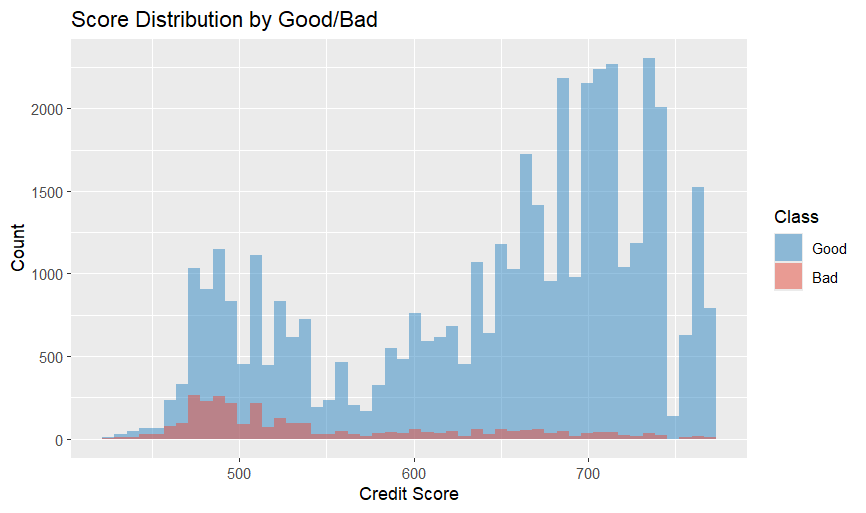
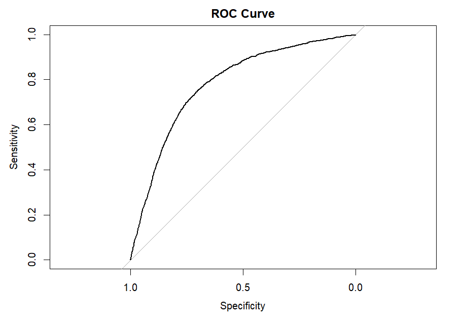
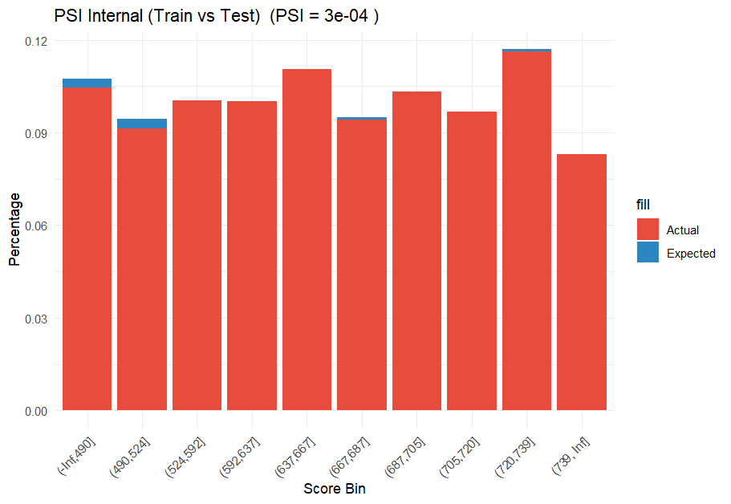
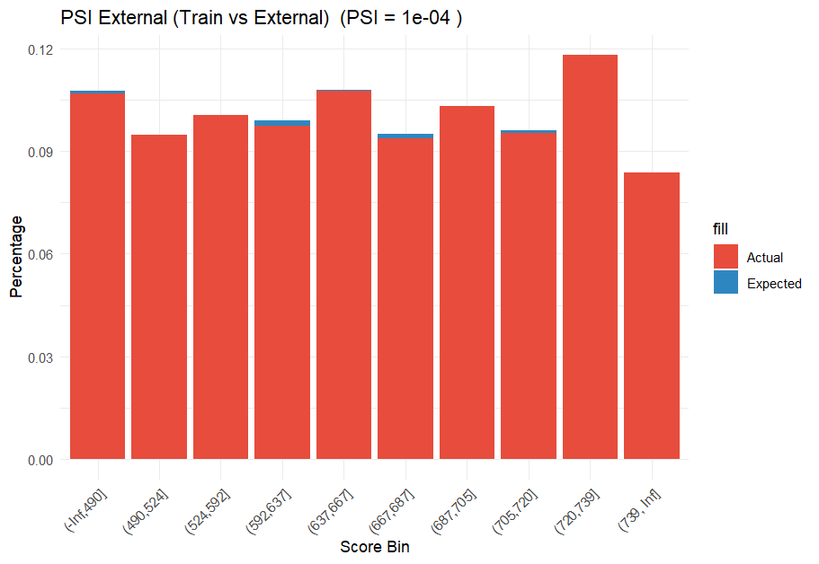

# Credit Risk Scorecard Model (R)

## Overview
This project develops a simple **credit risk scorecard** to estimate the probability of default using the **Give Me Some Credit** dataset from Kaggle.

The goal is to build a model that is:

- Easy to explain
- Stable across samples
- Usable as a scorecard

A **logistic regression scorecard** is used as the primary model, with **XGBoost** as a  performance benchmark.

## Dataset
- **Source**: Kaggle – [Give Me Some Credit](https://www.kaggle.com/competitions/GiveMeSomeCredit/data)
- Train file: `cs-training.csv`
- External scoring file: `cs-test.csv`
- Target variable: `SeriousDlqin2yrs` (1 = borrower was 90+ days past due or worse within 2 years, 0 = non-default)

## Main steps

### 1. Data Cleaning
- Remove rows with invalid age (`age <= 0`)
- Split the data into train (70%) and test (30%)
- Use the training set median to fill missing values in:
   `MonthlyIncome` and `NumberOfDependents`

Median imputation is used to preserve sample size and reduce the influence of outliers, giving a quick, robust baseline for further analysis.

### 2. WOE Binning and IV 
- Applied **WOE (Weight of Evidence)** binning using `scorecard` 
- Enforced **monotonicity** in WOE to ensure:
  - risk ordering is consistent
  - the model is more stable 
  - it is easier to explain to the business or regulators later  

- Special handling:
  - Missing values treated as separate bins    

- **Information Value (IV)** used for feature selection:

> Selected features satisfy: `0.02 < IV < 0.5`

This range balances predictive power while avoiding:
- weak predictors (low IV)
- overfitting or leakage (very high IV)

#### Selected variables:
  - `DebtRatio`
  - `RevolvingUtilizationOfUnsecuredLines`
  - `age`
  - `NumberOfOpenCreditLinesAndLoans`
  - `NumberRealEstateLoansOrLines`
  - `NumberOfDependents`  

### 3. Logistic Regression 
- Fit a logistic regression model on WOE transformed features
- Check the summary and coefficient significance
- Multicollinearity assessed using **VIF**
- Model kept simple to preserve interpretability

### 4. XGBoost Benchmark
- Trained on same WOE features
  
**Purpose:**
- Check if XGBoost gives better results than logistic regression, even though it's harder to explain.

### 5. Scorecard Conversion

The logistic model is converted into a scorecard:

  - Base points: 600
  - Odds at base: 1:15 (good:bad)
  - PDO (Points to Double Odds): 60
    
PDO = 60 is chosen as an industry standard. It makes the score scaling simple and easier to explain to the business side.

Score formula:  
  `Score = A - B * ln(odds)`  
where:
  - `B = PDO / ln(2)`
  - `A = Base + B * ln(odds0)`
  - `odds = p / (1-p)`

### 6. Model Evaluation

- **AUC** for discrimination
- **KS** for separation between good and bad 
- **PSI** for score stability

PSI is used not only for validation but also for:
- keeping an eye on data drift  
- deciding whether the model needs retraining in production

## Why these variables make sense

- **RevolvingUtilizationOfUnsecuredLines** - High utilization indicates higher pressure on credit

- **DebtRatio** - Higher debt-to-income ratio implies weaker repayment ability  

- **age** - Younger borrowers often have less stable income, leading to higher risk.

- **NumberOfDependents** - More dependents typically increase household expenses, making repayment harder.  

- **Credit line counts** - Reflects credit exposure and usage patterns

This helps the model stay interpretable, which is important for credit risk work.

## Results

### Model Performance

| Model | AUC (Test) | KS |
|------|------------|------|
| Logistic Regression | 0.7907 | 0.4625 |
| XGBoost | 0.7944 | — |

The logistic model works well and is stable on the test set. XGBoost gives a slightly higher AUC, but the improvement is small. So logistic regression is preferred because:

- it is easier to explain  
- it is easier to turn into a scorecard  

### Population Stability Index (PSI)

| Comparison | PSI | Interpretation |
|------------|------|----------------|
| Train vs. Test | 0.0003 | Very stable |
| Train vs. External | 0.0001 | Very stable |

Both values < 0.1, so the score distribution looks stable.

## Scorecard example

For the `age` variable, the scorecard gives different points for different bins, for example:

- younger borrowers get lower points
- older borrowers get higher points

The final score is the sum of the base score and all variable bin points.

## Deployment Considerations

To simulate how it would work in production:

- Ensured binning consistency between training and scoring  
- Model output can be directly used for:
  - credit approval  
  - setting prices based on risk  
  - deciding credit limits

## Code structure

project/
├── data/
├── src/
│ ├── preprocessing.R
│ ├── binning.R
│ ├── model.R
│ ├── evaluation.R
├── main.R
├── README.md

This modular design improves:
- maintainability  
- reproducibility  
- production readiness

## How to reproduce
1. Put `cs-training.csv` and `cs-test.csv` in the working directory
2. Install the packages
3. Run `Credit_Risk_Scorecard.R`

The script will print:

- Logistic regression summary
- XGBoost AUC
- Logistic AUC
- KS
- PSI values

Also generating the main plots.

## Plots
The script generates four plots:

### Score Distribution by Good/Bad – shows how scores separate good and bad borrowers

Bad samples are concentrated in lower score bands, while good samples are more concentrated in higher score bands, which is consistent with scorecard logic.

### ROC Curve – visualizes the model’s discrimination power

The Logistic Regression model achieved an AUC of 0.7806, indicating strong discriminative power.

### PSI Internal (Train vs. Test) – bar chart comparing score distributions

### PSI External (Train vs. External) – same comparison with the external scoring set

Internal PSI = 0.0003 and external PSI = 0.0001, both far below 0.1, suggesting stable population distribution.

## What this project shows

This project shows a basic but complete scorecard workflow:

- data cleaning
- WOE binning
- IV screening
- logistic regression
- scorecard conversion
- PSI monitoring
- a benchmark model for comparison

It is simple, but it covers the parts that matter in a credit risk project.

## Future work

- Feature engineering (behavioral variables, trends)  
- Class imbalance handling (SMOTE, cost-sensitive learning)  
- Probability calibration (Platt scaling)  
- Reject inference (approved vs. rejected applicants bias)  
- Automated monitoring (PSI dashboard)
